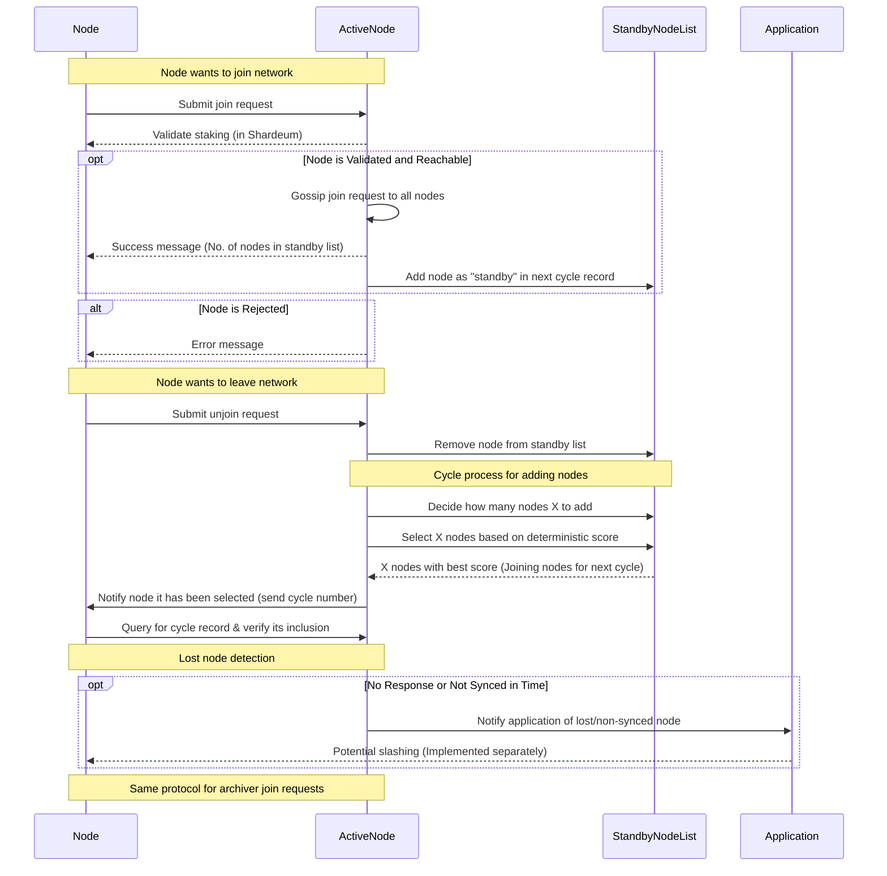

```mermaid
sequenceDiagram
    participant N as Node
    participant AN as ActiveNode
    participant SNL as StandbyNodeList
    participant A as Application
    Note over N,AN: Node wants to join network
    
    N->>AN: Submit join request
    AN-->>N: Validate staking (in Shardeum)
    
    opt Node is Validated and Reachable
        AN->>AN: Gossip join request to all nodes
        AN-->>N: Success message (No. of nodes in standby list)
        AN->>SNL: Add node as "standby" in next cycle record
    end
    
    alt Node is Rejected
        AN-->>N: Error message
    end
    
    Note over N,AN: Node wants to leave network
    
    N->>AN: Submit unjoin request
    AN->>SNL: Remove node from standby list
    
    Note over AN,SNL: Cycle process for adding nodes
    
    AN->>SNL: Decide how many nodes X to add
    AN->>SNL: Select X nodes based on deterministic score
    SNL-->>AN: X nodes with best score (Joining nodes for next cycle)
    AN->>N: Notify node it has been selected (send cycle number)
    N->>AN: Query for cycle record & verify its inclusion
    
    Note over N,AN: Lost node detection
    
    opt No Response or Not Synced in Time
        AN->>A: Notify application of lost/non-synced node
        A-->>N: Potential slashing (Implemented separately)
    end
    
    Note over N,AN: Same protocol for archiver join requests

```