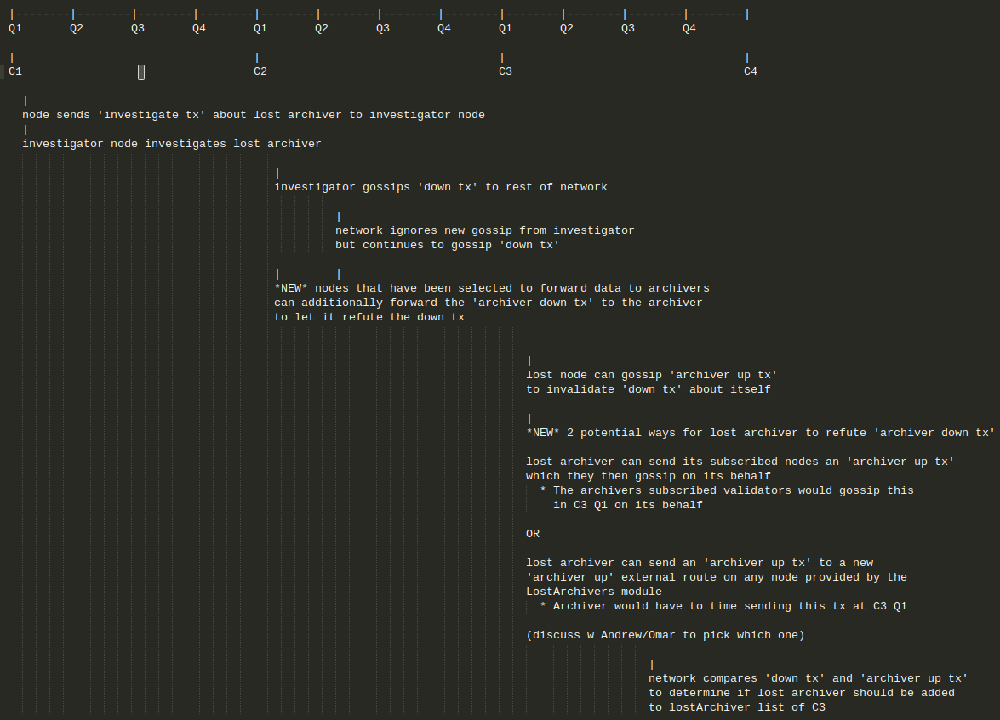
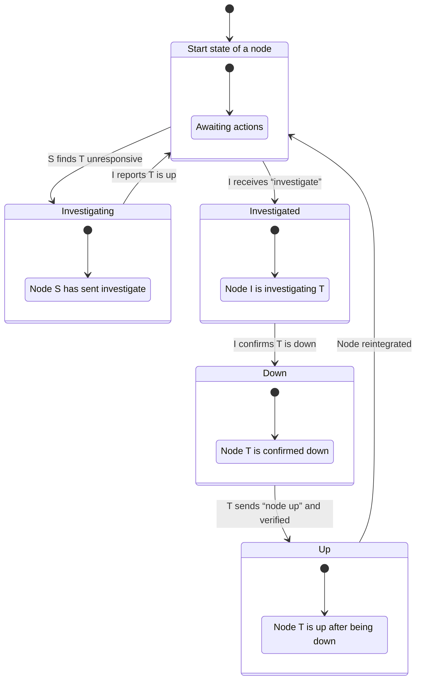

# Lost Archiver Detection Planning Doc

> Notes:
> 
> * What if a rogue node spoofs the 'ping' route to pass lost detection but otherwise doesn't contribute to the network?
>   
>   One proposed solution is to have a route that returns data that cant be spoofed unless the node is actively participating in the network.

## Types of txs/msgs:

`ArchiverInvestigateTransaction`

`ArchiverDownTransaction`

`ArchiverUpTransaction`

`ArchiverPingMessage`

## Needed Data structures:

`LostArchivers` map to save 'archiver down tx's and 'archiver up tx's by archiver and cycle

`InvestiagtedArchivers` map to save archivers we have investigated for this cycle to not investigate them again

`LostArchivers` cycle record field to record archivers that have been lost and must be removed from the network

## Needed Routes:

`gossip-node-down-tx`

`gossip-node-up-tx`

`internal-investigate-tx`

`internal-ping`

## Needed Logic/Functions:

[WIP]

