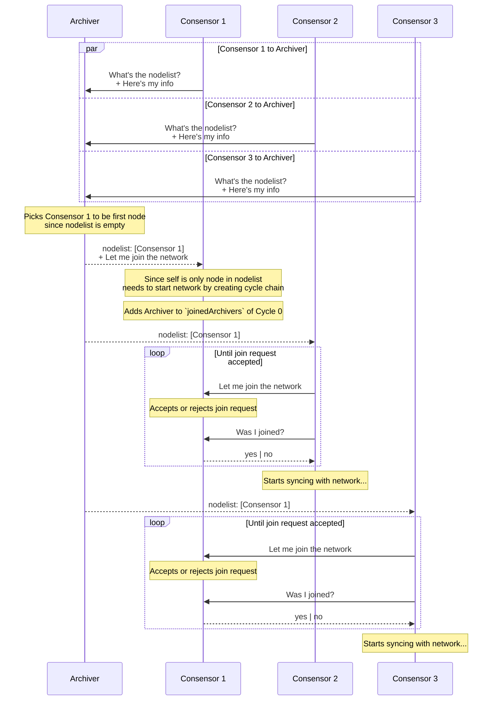

```mermaid
sequenceDiagram
  participant A as Archiver
  participant C1 as Consensor 1
  participant C2 as Consensor 2
  participant C3 as Consensor 3

  par Consensor 1 to Archiver
    C1->>A: What's the nodelist? <br/> + Here's my info
  and Consensor 2 to Archiver
    C2->>A: What's the nodelist? <br/> + Here's my info
  and Consensor 3 to Archiver
    C3->>A: What's the nodelist? <br/> + Here's my info
  end

  Note over A: Picks Consensor 1 to be first node <br/> since nodelist is empty

  A-->>C1: nodelist: [Consensor 1] <br/> + Let me join the network
  Note over C1: Since self is only node in nodelist <br/> needs to start network by creating cycle chain
  Note over C1: Adds Archiver to `joinedArchivers` of Cycle 0

  A-->>C2: nodelist: [Consensor 1]
  loop Until join request accepted
    C2->>C1: Let me join the network
    Note over C1: Accepts or rejects join request
    C2->>C1: Was I joined?
    C1-->>C2: yes | no
  end
  Note over C2: Starts syncing with network...

  A-->>C3: nodelist: [Consensor 1]
  loop Until join request accepted
    C3->>C1: Let me join the network
    Note over C1: Accepts or rejects join request
    C3->>C1: Was I joined?
    C1-->>C3: yes | no
  end
  Note over C3: Starts syncing with network...

```