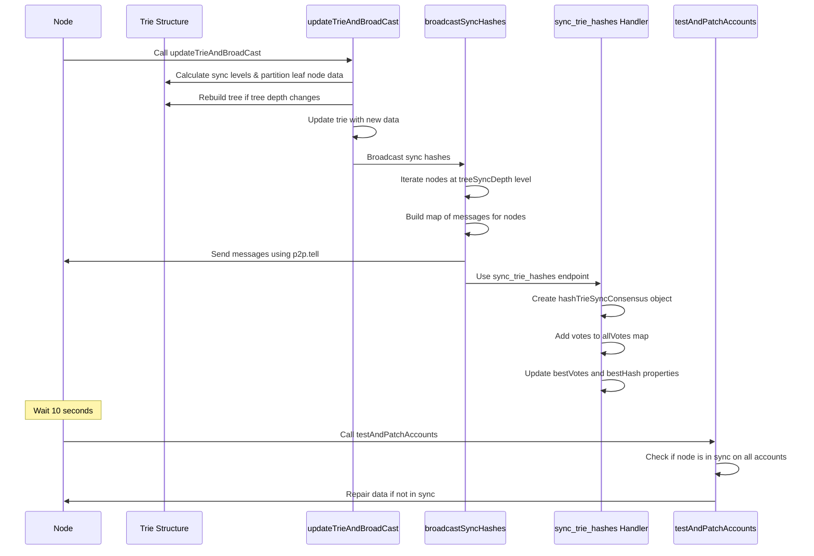
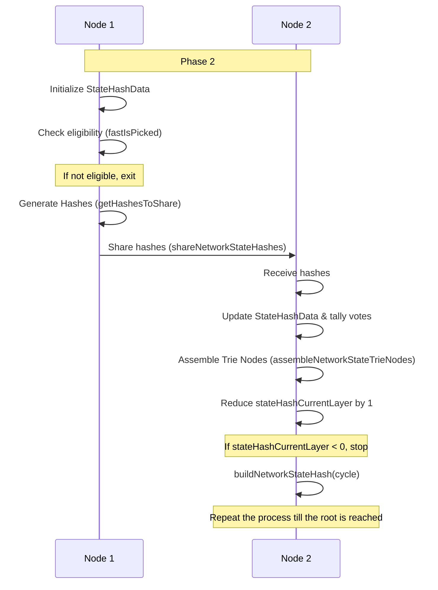

# Sharded-Hash-Trie System: Existing functionally

The sharded-hash-trie system use a custom distributed data structure that allows a dynamically sharded system to have consensus on data state.

## updateTrieAndBroadCast Function

The core function, `updateTrieAndBroadCast`, updates a trie data structure and broadcasts the changes. The function calculates the sync levels, determines the new sync depth, and partitions the leaf node data into leaves of the correct level. The function also rebuilds the tree if the depth of the tree changes. Finally, the function updates the trie with any new data and broadcasts the sync hashes.

## broadcastSyncHashes Function

The `broadcastSyncHashes` function broadcasts the sync hashes of a trie data structure. It iterates through the nodes of the trie at the `treeSyncDepth` level and determines which nodes can be sent based on specific conditions. This function builds a map of messages to be sent to the appropriate nodes and sends them using the `p2p.tell` method. This function also keeps track of certain statistics, such as the number of skipped broadcasts and the radix values used. The function uses the `sync_trie_hashes` endpoint.

## Sync Trie Hashes Handler

The handler for `sync_trie_hashes` is responsible for syncing the trie hashes between nodes in the network. It creates a `hashTrieSyncConsensus` object for each cycle and then adds votes to the `allVotes` map for each hash. The function updates the `bestVotes` and `bestHash` properties of the `hashVote` object if the current vote count is greater than the `bestVotes` property.

## Test And Patch Accounts Function

After a waiting period of 10 seconds, the `testAndPatchAccounts` function is called to test if the node was in sync on all accounts, and to repair data if it was not.

## Sequence diagram (ai-generated and kinda terrible)



# New code to support network state hash:

This code will have nodes work together in an efficient way to generate the network state hash (root) of the
sharded-hash-trie.

## Required Data Structures

A data structure (StateHashData) is needed to track progress as our node works through this process.
This data structure should know which cycle number it is associated with. StateHashData objects should be kept in
a map by cycle. stateHashDataByCycle : Map<number, StateHashData>
Functions that need this data should look it up from the map by the given cycle using
getStateHashDataByCycle(number): StateHashData
This will make the code robust against timing issues.

StateHashData will have stateHashStartLayer:number value to show what layer it is staring on. This will be one less
than the layer that sync hashes were generated (treeSyncDepth).
It will also have stateHashCurrentLayer:number that will start with the same value of stateHashStartLayer but
decrement as we work our way to forming the root hash.

StateHashData will have a map of level:number to StateHashLevelData (stateHashDataByLevel)
StateHashLevelData will have a HashTrieSyncConsensus object used to track votes at this level.
StateHashLevelData:participatingNodeIndices will have an array of number indices to show which nodes participate at this level
These indices refer to the index in the active nodes list for the given cycle.

The data we are building should be stored as upperShardTrie: ShardedHashTrie.
This is the portion of the sharded hash trie that our node is working to generate at each level.

## Building the Network State Hash

### create buildNetworkStateHash(cycle)

A new async function buildNetworkStateHash(cycle) should be created.
buildNetworkStateHash should be called before testAndPatchAccounts and not awaited.

### lazy init StateHashData for this cycle

If getStateHashDataByCycle() == null, then initialize and add a new StateHashData entry.
If we have more than 5 entries in the map delete entries with a cycle older than 5.
Be sure to setup the correct field starting values for stateHashStartLayer, stateHashCurrentLayer etc.

We will use StateHashData:stateHashCurrentLayer and work on one layer(depth) of the trie
at a time. Initially we start one layer above (smaller index) than the treeSyncDepth

### check node eligibility to participate

First we should test if our node is eligible to help participate in the this process.
Use fastIsPicked() to determine this. Groupsize is number of partitions for the current cycle
(shardGlobals.numPartitions). Our index is our index in the active node list. I think this should already
be precalculated as ourNodeIndex somewhere. NumToPick is ceil (numPartitions / (16/3) ). Offset should be
based on the first few bytes of the last cyclemarker. Please use a configurable minNodeToShareStateHash,
default 10 and use this with max (NumToPick, minNodeToShareStateHash). This will prevent us from having
edge cases with too few voters.

If our node is selected than proceed with the algorithm below, otherwise exit the function.

### Overview

Next we communicate hashes with other nodes so that by working together nodes can have enough
data to build the hashes for the next layer up in the trie. This process will repeat
and each time we will pick less nodes to participate. Nodes will only be sharing hash data
with other nodes that can utilize it. Below are details.

### generate list of picked nodes

buildNetworkStateHash() implementation:
utils:getIndexesPicked() to generate a list of picked indexes to save on the structure.
StateHashLevelData:participatingNodeIndices will be here we store these indices.

### implement and call getHashesToShare()

buildNetworkStateHash should then call the new function getHashesToShare()
getHashesToShare() is similar to isInSync() as it will get the hashTrieSyncConsensus for
the specified cycle. This will loop over radixHashVotes.keys() in a way similar to isInSync.
Instead of calculating the hashes it will instead build an array that is
sorted by radix of: {radix, hash, numvotes}. hash and numvotes will come from the besthash,bestvotes
of the votesmap. and the end sort this list by radix. Place this array on the correct instance
on StateHashLevelData:hashesToShare. This and other values are things that we could just pass along
as local vars and function params, but I think debugging will be more sane if we capture and read
relevant data from the correct structures.

Note, getHashesToShare() only will used votes from the sync hash voting for the first round.
After that it will use the votes stored on the StateHashLevelData instance for the given trie
depth we are operating on (well, one down from what we are working to solve)

### implement and call shareNetworkStateHashes()

Next need a function shareNetworkStateHashes() this function is first must build out a plan
for which hashes will be sent to which nodes. Ideally we could have some cases where we are sending the same data and can do a multi-tell. It can get tricky to bucket things up. I suppose a simple way to do it is by concatenating the the ratix values that will be sent (sorted). This can be a key to a list of nodes that can take that given set of data along with an array of the non concatenated radix values. If we solve this in a "first pass" then we can make perfect buckets.
The next pass will be to iterate through the bucket values above and and for each bucket build a message given the array of radix values we want to forward. Then do a multi tell to all the nodes in the list that will get this data.

### calculating coverage ranges in shareNetworkStateHashes

To figure out exactly which nodes can cover which data you need to look at the value of each sharable radix. We will look to the left and right of our node in the Index list listed earlier for the level we ae sharing (all the nodes participating in teh share at this level). Left and right mean walking through index list in the positive and negative directions remember to loop if you get to the either end of the array. Once you have a node for a given direction that does not cover any of your hashes, then you stop looking in that direction. Be careful how you setup these loops. Go for what is clear and readable. Don't
use declarative loops in any of this project. The performance and readability are too low.

### build_network_state_hash endpoint handler

To receive the data above we need a handler for 'build_network_state_hash' it will have some similarities to 'sync_trie_hashes' but will be saving off data to the correct spot in our StateHashData instance.
votes will get totaled in the appropriate layer in StateHashData

### wait for votes to come in

Wait X seconds (lets try 10) (schedule the below to get called)

### check votes, update trie, update values

Reduce the value of stateHashCurrentLayer by 1. This means we are solving for the next set of hashes closer to the root.
If this value goes below 0 then break the loop
Now that we actually have the votes available we need to create trie nodes from them based on that every trie node we want to build should have the full set of 16 children nodes. I.e. maybe we just shared 4E0 4E1 and 4E2. once we have vote confirmation on these we need to build a radix for "4E". This wil get votes we "loop" to work on the next level higher our node will be sharing "4E". after that if selected in the next smaller group of nodes our node will solve for "4" and then eventually root. This logic mentioned above should be in a function called assembleNetworkStateTrieNodes. Note that these trie nodes are only stored in the correct spot for the StateHashData system.

### loop by scheduling a call to buildNetworkStateHash()

Then run buildNetworkStateHash(cycle) again but this time it will be solving for hashes on tier up (closer to root) than what we just solved.

## Data structure reference

### (note this could be missing some things from the writeup above)

```ts
interface HashVote {
  radix: string;
  hash: string;
  numVotes: number;
}

interface StateHashLevelData {
  hashTrieSyncConsensus: HashTrieSyncConsensus;
  participatingNodeIndices: number[];
  hashesToShare: HashVote[];
}

interface StateHashData {
  cycle: number;
  stateHashStartLayer: number;
  stateHashCurrentLayer: number;
  stateHashDataByLevel: Map<number, StateHashLevelData>;
  upperShardTrie: ShardedHashTrie;
}

interface ShardedHashTrie {
  // structure of the ShardedHashTrie goes here
}

interface HashTrieSyncConsensus {
  // structure of the HashTrieSyncConsensus goes here
}
```

## Sequence diagram for building netowrk state hash

AI generated, a bit of mess



# Tasks

AI generated and I have to replace these...

1. **Data Structures Definition and Setup**

   - Task: Create the `StateHashData` and `StateHashLevelData` TypeScript interfaces, along with the `stateHashDataByCycle` map. Implement the `getStateHashDataByCycle(number)` function for lookup.

2. **Initialize StateHashData**

   - Task: Implement the initialization of `StateHashData` in `buildNetworkStateHash(cycle)` and manage entries in the `stateHashDataByCycle` map.
   - Details: The function needs to initialize a new `StateHashData` object if `getStateHashDataByCycle()` returns null. If there are more than 5 entries in the map, remove entries with a cycle older than 5.

3. **Implement Node Eligibility Check**

   - Task: Incorporate the `fastIsPicked()` function to determine if the current node can participate in the process.
   - Details: The function needs to ensure that only eligible nodes, based on parameters like group size, node index, `NumToPick` and offset, participate in the process.

4. **Generate and Share Hashes**

   - Task: Implement the `getHashesToShare()` function to generate hashes, and then share these using the `shareNetworkStateHashes()` function.
   - Details: The `getHashesToShare()` function needs to generate an array of hashes from the votes map and sort it by radix. The `shareNetworkStateHashes()` function should send these hashes to appropriate nodes using the `p2p.tell` method.

5. **Implement Data Reception and Vote Totaling**

   - Task: Implement the handler for 'build_network_state_hash' to receive shared data and tally the votes.
   - Details: The handler should update the `StateHashData` structure with received data and update votes for the appropriate layer in `StateHashData`.

6. **Assemble Trie Nodes**

   - Task: Implement the `assembleNetworkStateTrieNodes()` function to create trie nodes from the votes.
   - Details: This function should build trie nodes from the votes and store them in the `StateHashData` structure.

7. **Recursive Call to buildNetworkStateHash()**

   - Task: Implement the logic to reduce `stateHashCurrentLayer` by 1 and make a recursive call to `buildNetworkStateHash(cycle)` for solving hashes closer to the root.
   - Details: Ensure that the recursive process stops when `stateHashCurrentLayer` reaches 0.

8. **Final Testing and Refinements**
   - Task: Test the implementation with different scenarios to ensure the robustness of the implementation and make necessary refinements.
   - Details: The test should cover different scenarios including edge cases to ensure the correct working of the new network state hash generation process.
