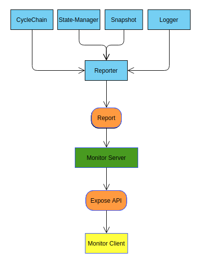

# Reporting

Active nodes in the Shardus network will reports various useful information about the Node and Network to a monitor server. Monitor server will process those data (report) received from the Nodes and expose an API. A front-end application (Monitor Client) will use this API to show the information in Graphical User Interface. Developers can easily view the status and information of Nodes, Transaction Statistics and Network related information using monitor client.

### Overview of Reporting System



### Consenser Nodes

All nodes will report to monitor server whenever there is a change in Node's status (joining, joined, active, removed). While a node is active and participating in the network, it will send these information to monitor server at a regular internal provided in the server configuration.

**Report Data Structure**

```ts
interface report {
  repairsStarted: number;
  repairsFinished: number;
  appState: string;
  cycleMarker: string;
  cycleCounter: number;
  nodelistHash: string;
  desiredNodes: number;
  txInjected: number;
  txApplied: number;
  txRejected: number;
  txExpired: number;
  txProcessed: number;
  reportInterval: number;
  nodeIpInfo: IPInfo;
  partitionReport: any;
  globalSync: boolean;
  partitions: number;
  partitionsCovered: number;
  currentLoad: number;
  queueLength: any;
  txTimeInQueue: number;
  cycleRecord: CycleRecord;
  missingPartitions: number[];
  logs: any;
}
```

_Reporter.ts_ module is responsible for collecting and sending the data to monitor server. Reporter module will collect data from following modules to build the report.

- p2p/CycleChain
- State-Manager
- Snapshot
- Logger

## Monitor Server

The main function of monitor server is to validate, process and store the reports sent from Conseser Nodes. Monitor server expose `/api/report` endpoint to provide the summary of reports received from consenser nodes.

**Report**

```ts
export interface Report {
  nodes: NodeList;
  totalInjected: number;
  totalRejected: number;
  totalExpired: number;
  totalProcessed: number;
  timestamp: number;
}
```

Following sections represent the NodeList data structure exposed by monitor server.

**NodeList**

```ts
export interface NodeList {
  joining: {
    [key: string]: {} | JoinReport;
  };
  syncing: {
    [key: string]: {} | SyncReport;
  };
  active: {
    [key: string]: {} | ActiveReport;
  };
}
```

**JoinReport**

```ts
export interface JoinReport {
  nodeIpInfo: NodeIpInfo;
}
```

**SyncReport**

```ts
export interface SyncReport {
  publicKey: string;
  nodeIpInfo: NodeIpInfo;
}
```

**ActiveReport**

```ts
export interface ActiveReport {
  repairsStarted: number;
  repairsFinished: number;
  appState: string;
  cycleMarker: string;
  cycleCounter: number;
  nodelistHash: string;
  desiredNodes: number;
  txInjected: number;
  txApplied: number;
  txRejected: number;
  txExpired: number;
  txProcessed: number;
  reportInterval: number;
  nodeIpInfo: NodeIpInfo;
  partitionReport:
    | {}
    | {
        res: PartitionInfo[];
        cycleNumber: number;
      };
  globalSync: boolean;
  partitions: number;
  partitionsCovered: number;
  currentLoad: number;
  queueLength: number;
  txTimeInQueue: number;
  cycleRecord: CycleRecord;
  missingPartitions: number[];
  logs: any;
  timestamp: number;
}
```

**PartitionInfo**

```ts
export interface PartitionInfo {
  i: number;
  h: string;
}
```

**NodeIpInfo**

```ts
export interface NodeIpInfo {
  externalIp: string;
  externalPort: number;
  internalIp: string;
  internalPort: number;
}
```

## Monitor Client

Monitor client is a front-end application which shows the data (reports) from consensus nodes in an graphical form. Monitor client will query the report from monitor server via `/api/report` endpoint every 2 seconds. It will process and represent the nodes as grey, yellow, green, red circles, txs as small red dots and Network as big circle.
