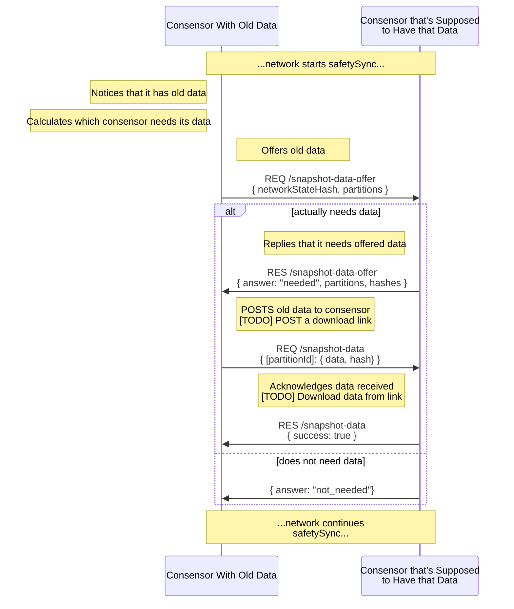

```mermaid
sequenceDiagram
  participant C1 as Consensor With Old Data
  participant C2 as Consensor that's Supposed <br/> to Have that Data

  Note over C1,C2: ...network starts safetySync...

  Note left of C1: Notices that it has old data
  Note left of C1: Calculates which consensor needs its data

  Note right of C1: Offers old data
  C1->>C2: REQ /snapshot-data-offer <br/> { networkStateHash, partitions }

  alt actually needs data

    Note left of C2: Replies that it needs offered data
    C2->>C1: RES /snapshot-data-offer <br/> { answer: "needed", partitions, hashes }

    Note right of C1: POSTS old data to consensor <br/> [TODO] POST a download link
    C1->>C2: REQ /snapshot-data <br/> { [partitionId]: { data, hash} }

    Note left of C2: Acknowledges data received <br/> [TODO] Download data from link
    C2->>C1: RES /snapshot-data <br/> { success: true }

  else does not need data

    C2->>C1: { answer: "not_needed"}

  end

  Note over C1,C2: ...network continues <br/> safetySync...
```
