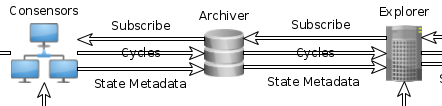

# State Metadata

## Necessary Context

2 kinds of partitions:

- Data partitions
- Summary Partitions

\# of data partitions = # of nodes

\# of summary partitions = const 64 for now (powers of 2 in the future)

When a node joins the network, stats summary partitions are computed once, then
updated with each tx

## Metadata Flow

0. Archivers subscribe to Consensors to receive updates. Explorers subscribe to
   Archivers to receive updates.

 

  

 

1. When all the txs for a cycle have settled, all Consensors gossip and collect
   3 kinds of partition hashes for that cycle:

   1. `data_hash_n = hash([account_000_hash, ..., account_999_hash])`  
      The hash of all account hashes in data partition block `n`
   2. `receipt_hash_n = hash(receipt_map_n)`  
      The hash of the receipt map in data partition block `n`
   3. `summary_hash_n = hash(summary_blob_n)`  
      The hash of the app defined summary blob in summary partition block `n`

2. When a Consensor has collected the hashes for all partition blocks in a given
   cycle, it uses them to compute 3 network level hashes for that cycle:

   1. `network_data_hash = hash([data_hash_1, data_hash_2, ...])`  
      The hash of all data partition block `data_hash`es in a given cycle
   2. `network_receipt_hash = hash([receipt_hash_1, receipt_hash_2, ...])`  
      The hash of all data partition block `receipt_hash`es in a given cycle
   3. `network_summary_hash = hash([summary_hash_1, summary_hash_2, ...])`  
      The hash of all summary partition block `summay_hash`es in a given cycle

3. When a Consensor has computed a network level hash for a cycle:

   - the signed network level hash. Ex: `network_data_hash`
   - and the partition level hashes used to compute that network hash. Ex:  
     `[data_hash_1, data_hash_2, ...]`

   are sent as an update to the Consensors subscribers.

   _NOTE: Having a Consensor sign network level hashes makes them provable using the Cycle Chain_

4. When an Archiver gets a:

   - `network_receipt_hash` (+ supporting hashes) update
   - or a `network_summary_hash` (+ supporting hashes) update

   from a Consensor for a cycle, the Archiver figures out and queries all
   Consensors needed to collect additional data:

   - For a `network_receipt_hash` update, receipt maps from all data partition
     blocks in the cycle. Ex:  
     `[receipt_map_1, receipt_map_2, ...]`
   - For a `network_summary_hash` update, summary blobs from all summary
     partition blocks in the cycle. Ex:  
     `[summary_blob_1, summary_blob_2, ...]`

   If an Archiver gets a `network_data_hash` update, it doesn't need to collect
   any additional data.

   Once additional data is collected, the signed update from the Consensor
   (+ any collected data) is forwarded to Explorers subscribed to the Archiver.

5. When an Explorer gets an update from an Archiver, the update's signature is
   validated against the Explorer's node list, and additional data is parsed:

   - `receipt_map`s are indexed and used to validate tx receipts
   - `summary_blob`s are reduced in an app specified way and served
