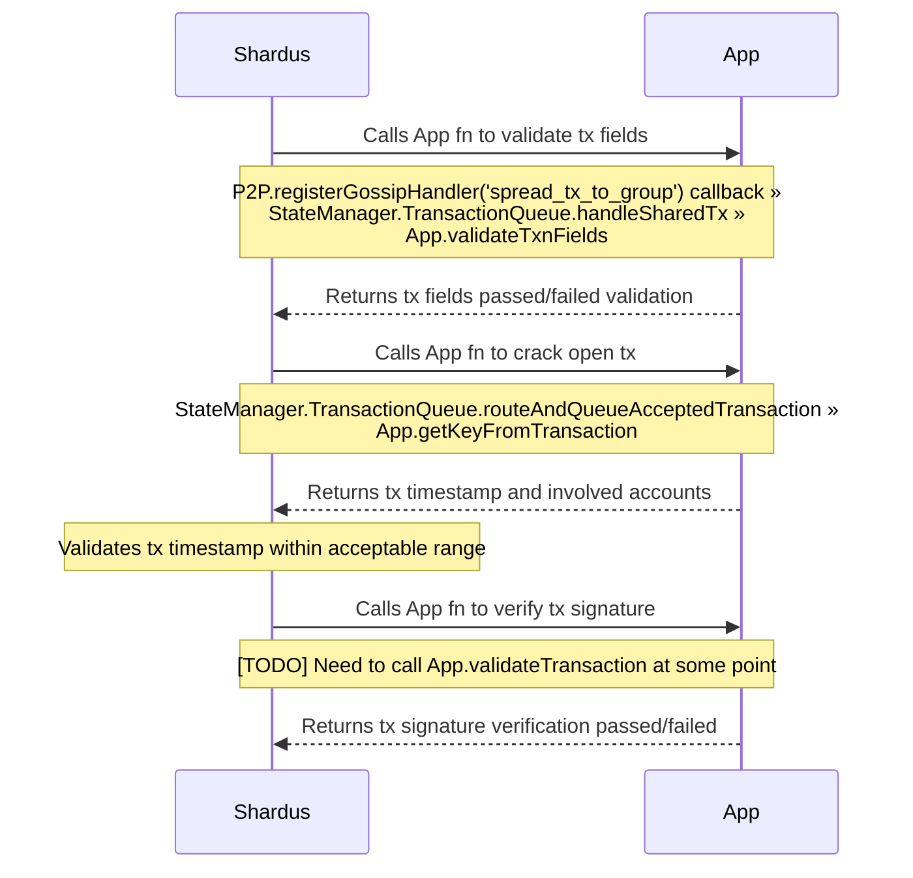
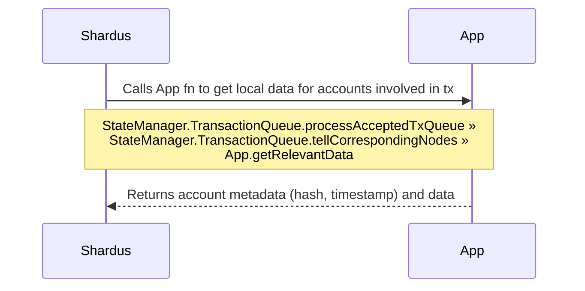
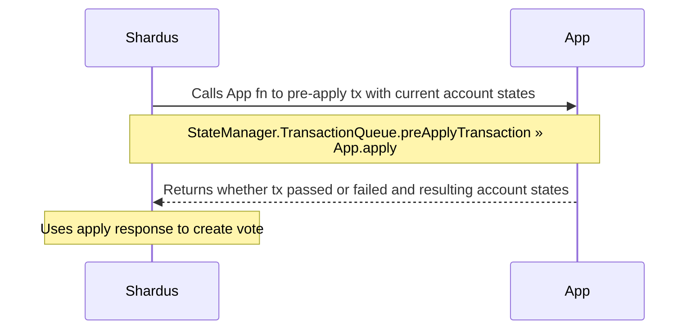
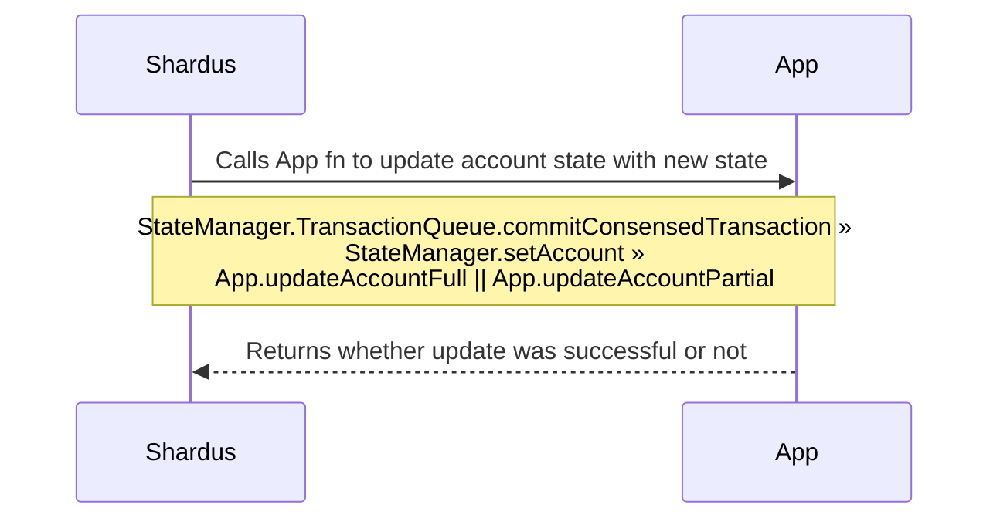

# Shardus Transaction Flow

## Overview


## Implementation of Steps (1) - (5) in `shardus-global-server`

```
1. App's /inject endpoint

2. Shardus.put(...)

2. Consensus.inject(...)

2. Consensus.on('accepted', (...) => { StateManager.TransactionQueue.routeAndQueueAcceptedTransaction(...) })

3. P2P.sendGossipIn('spread_tx_to_group', ...)

4. P2P.registerGossipHandler('spread_tx_to_group', StateManager.TransactionQueue.handleSharedTX(...))

5. StateManager.TransactionQueue.newAcceptedTxQueueTempInjest.push(txQueueEntry)
   StateManager.TransactionQueue.newAcceptedTxQueueTempInjestByID.set(txQueueEntry.acceptedTx.id, txQueueEntry)
```

## Validate Crack Verify: Steps (2) (4)



## Get Local Account Data: Step (6)



## Pre-apply Tx to Create Vote: Step (9)



## Apply Verify Fix: Step (14)



[Differences betweeen diagrams and actual implementation](./TODO.md)
