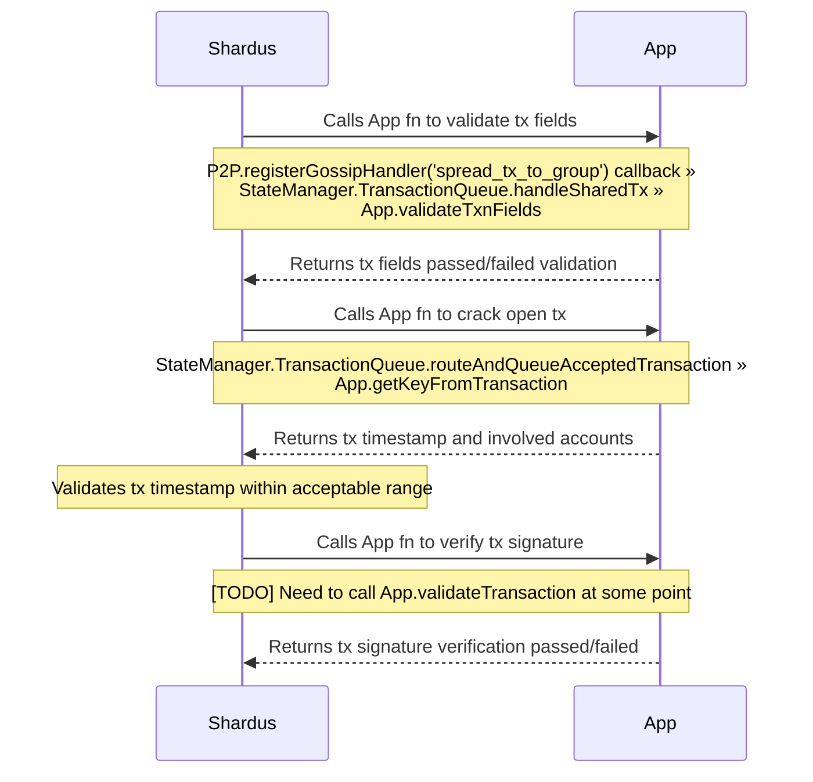
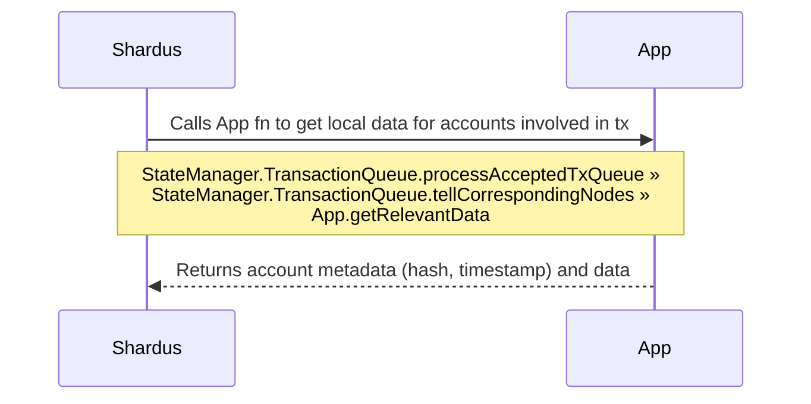
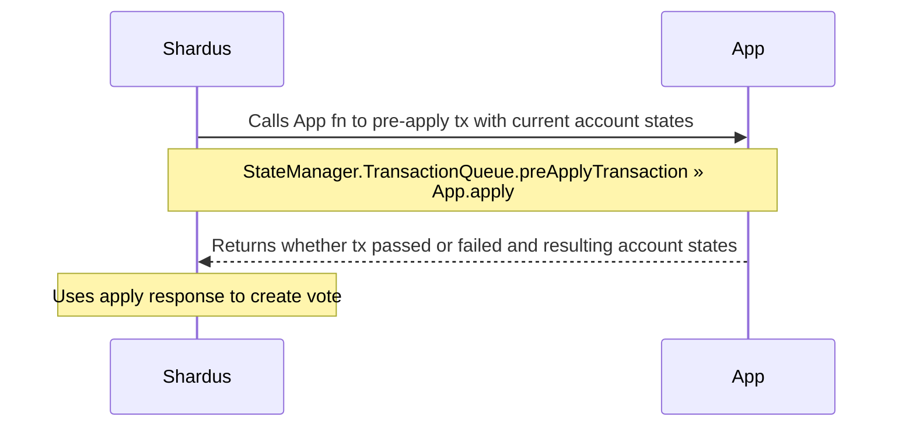
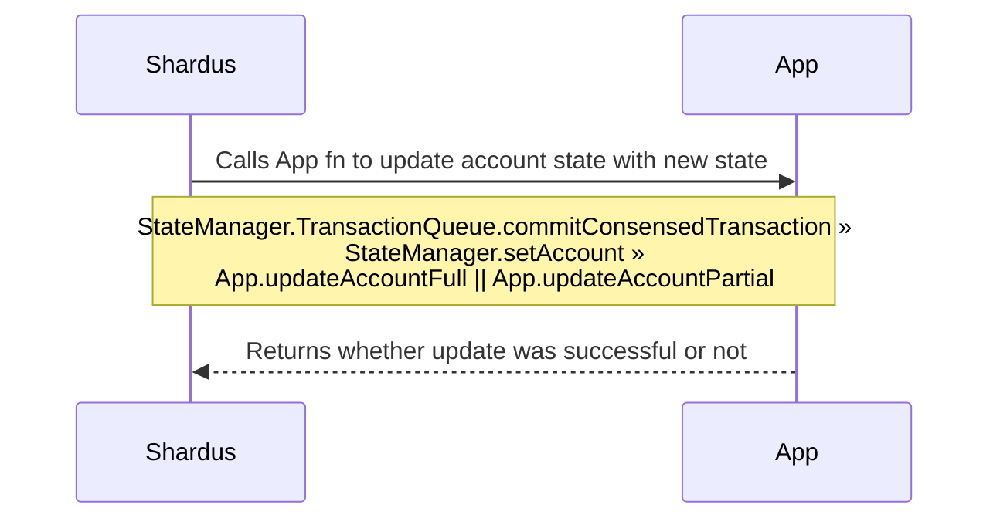

# Validate Crack Verify: (2) (4)

```mermaid
sequenceDiagram
	participant S as Shardus
	participant A as App

    S ->> A: Calls App fn to validate tx fields
    Note over S, A: P2P.registerGossipHandler('spread_tx_to_group') callback » <br> StateManager.TransactionQueue.handleSharedTx » <br> App.validateTxnFields

    A -->> S: Returns tx fields passed/failed validation

    S ->> A: Calls App fn to crack open tx
    Note over S, A: StateManager.TransactionQueue.routeAndQueueAcceptedTransaction » <br> App.getKeyFromTransaction
    A -->> S: Returns tx timestamp and involved accounts
    Note over S: Validates tx timestamp within acceptable range

    S ->> A: Calls App fn to verify tx signature
    Note over S, A: [TODO] Need to call App.validateTransaction at some point
    A -->> S: Returns tx signature verification passed/failed
```

# Get Local Account Data: (6)

```mermaid
sequenceDiagram
	participant S as Shardus
	participant A as App

    S ->> A: Calls App fn to get local data for accounts involved in tx
    Note over S, A: StateManager.TransactionQueue.processAcceptedTxQueue » <br> StateManager.TransactionQueue.tellCorrespondingNodes » <br> App.getRelevantData
    A -->> S: Returns account metadata (hash, timestamp) and data
```

# Pre-apply Tx to Create Vote: (9)

```mermaid
sequenceDiagram
    participant S as Shardus
    participant A as App

    S ->> A: Calls App fn to pre-apply tx with current account states
    Note over S, A: StateManager.TransactionQueue.preApplyTransaction » <br> App.apply
    A -->> S: Returns whether tx passed or failed and resulting account states
    Note over  S: Uses apply response to create vote
```

# Apply Verify Fix: (14)

```mermaid
sequenceDiagram
    participant S as Shardus
    participant A as App

    S ->> A: Calls App fn to update account state with new state
    Note over S, A: StateManager.TransactionQueue.commitConsensedTransaction » <br> StateManager.setAccount » <br> App.updateAccountFull || App.updateAccountPartial
    A -->> S: Returns whether update was successful or not
```
