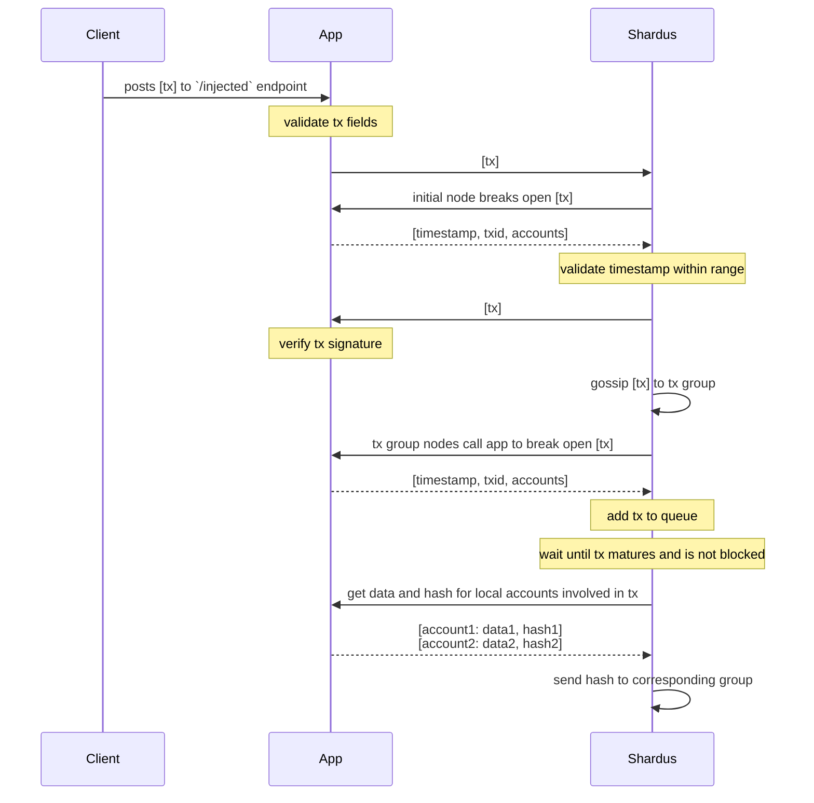

```mermaid
sequenceDiagram
	participant C as Client
	participant A as App
	participant S as Shardus
	C ->> A: posts [tx] to `/injected` endpoint
	Note over A: validate tx fields
    A ->> S : [tx]
    S ->> A: initial node breaks open [tx]
    A -->> S: [timestamp, txid, accounts]
    Note over S: validate timestamp within range
    S ->> A: [tx]
    Note over A: verify tx signature
        S ->> S: gossip [tx] to tx group
        S ->> A: tx group nodes call app to break open [tx]
        A -->> S: [timestamp, txid, accounts]
        Note over S: add tx to queue
        Note over S: wait until tx matures and is not blocked
        S ->> A: get data and hash for local accounts involved in tx
        A -->> S: [account1: data1, hash1] <br> [account2: data2, hash2]
        S ->> S: send hash to corresponding group
    
```