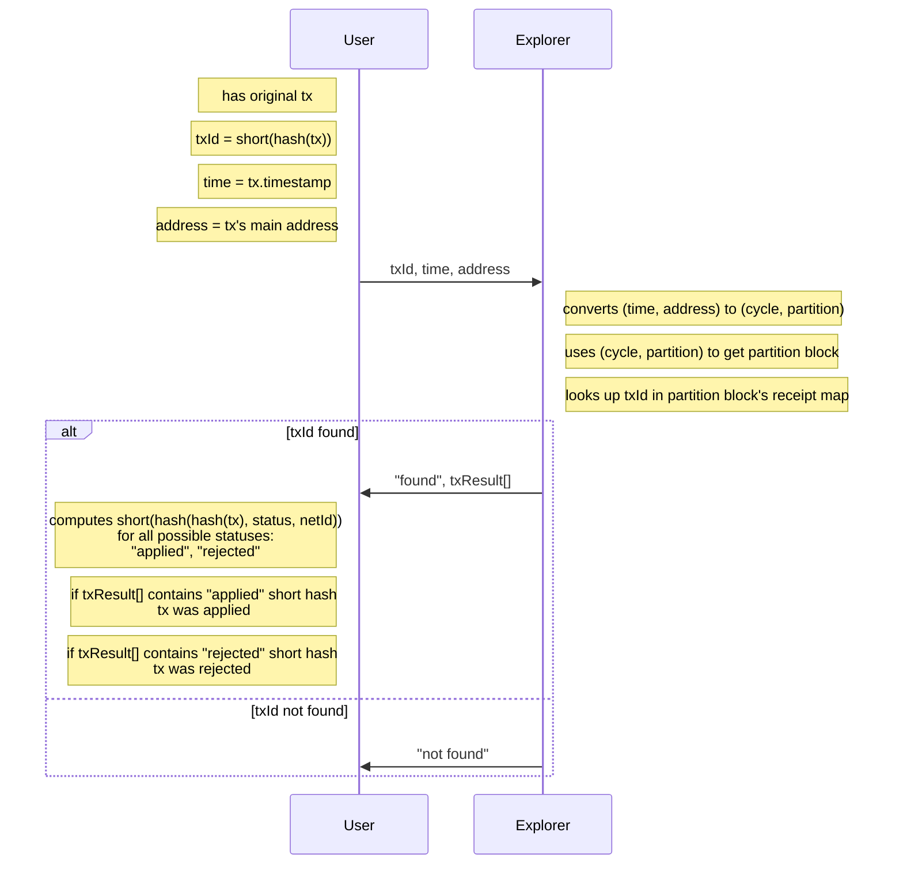

```mermaid
sequenceDiagram

    participant U as User
    participant E as Explorer

    Note left of U: has original tx
    Note left of U: txId = short(hash(tx))
    Note left of U: time = tx.timestamp
    Note left of U: address = tx's main address

	U->>E: txId, time, address

    Note right of E: converts (time, address) to (cycle, partition)
    Note right of E: uses (cycle, partition) to get partition block
    Note right of E: looks up txId in partition block's receipt map

    alt txId found

      E->>U: "found", txResult[]

      Note left of U: computes short(hash(hash(tx), status, netId)) <br/> for all possible statuses: <br/> "applied", "rejected"
      Note left of U: if txResult[] contains "applied" short hash <br/> tx was applied
      Note left of U: if txResult[] contains "rejected" short hash <br/> tx was rejected

    else txId not found

      E->>U: "not found"

    end
```